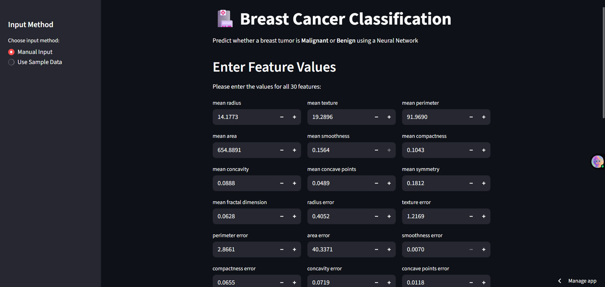
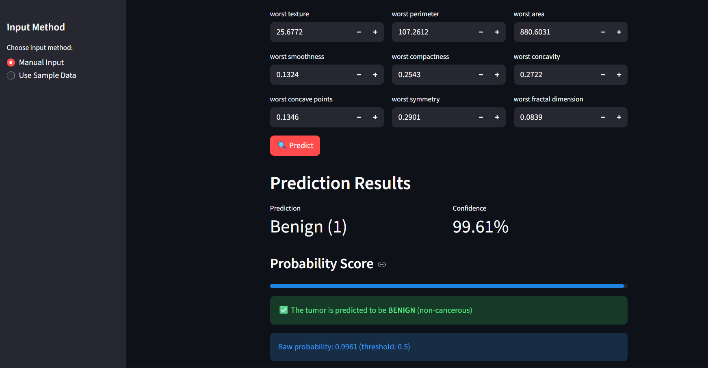

<h1 align="center">🏥 Breast Cancer Classification using Neural Network</h1>

  <b>Predict whether a breast tumor is Malignant or Benign using a custom-built Neural Network in PyTorch</b> 
   
  <a href="https://breascancerdata.streamlit.app/" target="_blank">
    🎯 Live Demo
  </a> |
  <a href="https://github.com/thewebgenius/Breast-cancer--Prediction-" target="_blank">
    💻 GitHub Repository
  </a>

---

<h2>📘 Project Overview</h2>

This project demonstrates my first step into <b>Neural Networks</b> — where I built and trained a simple neural network from scratch using <b>PyTorch</b> to classify breast cancer tumors based on 30 features from the <code>sklearn.datasets.load_breast_cancer</code> dataset.  

The model is deployed as an interactive web application using <b>Streamlit Cloud</b>.

---

<h2>🧠 Key Learning</h2>

- Learned how <b>Autograd</b> works in PyTorch (derivatives, backward propagation, gradient descent).  
- Built a neural network manually — no pre-built `nn.Linear()` layer used.  
- Implemented the <b>Sigmoid activation</b> and <b>Binary Cross-Entropy Loss</b> manually.  
- Explored <b>data preprocessing</b> using StandardScaler and model evaluation on unseen data.  
- Deployed a live model with <b>Streamlit</b> for real-time predictions.

---

<h2>⚙️ Technologies Used</h2>

| Category | Tools / Libraries |
|-----------|-------------------|
| Language | Python |
| Framework | PyTorch |
| Web App | Streamlit |
| Data | Scikit-learn Breast Cancer Dataset |
| Preprocessing | StandardScaler (sklearn) |
| Others | NumPy, Pandas |

---

<h2>🚀 Features</h2>

✅ Train a Neural Network from scratch (weights & biases initialization)  
✅ Manual and sample-based input options  
✅ Interactive prediction interface  
✅ Confidence score with progress bar visualization  
✅ Clean, modern UI built using Streamlit  

---

<h2>🧩 Model Workflow</h2>

1. **Data Loading:**  
   Used `load_breast_cancer()` from sklearn to get features & labels.  

2. **Data Preprocessing:**  
   - Split data into train/test sets  
   - Scaled features with `StandardScaler`  

3. **Model Building:**  
   - Manually implemented forward pass  
   - Used PyTorch `Autograd` for backpropagation  
   - Updated weights and bias manually  

4. **Training:**  
   - Binary cross-entropy loss  
   - Sigmoid activation function  
   - Gradient descent optimizer  

5. **Deployment:**  
   - Saved model using `torch.save()`  
   - Deployed web interface via **Streamlit Cloud**

---

<h2>📊 Sample Output</h2>

  
   

---

<h2>🌐 Live Demo</h2>

👉 **Try it yourself here:**  
<a href="https://breascancerdata.streamlit.app/" target="_blank">
  <b>🔗 https://breascancerdata.streamlit.app/</b>
</a>

---

---

<h2>🧠 Future Improvements</h2>

- Add hidden layers for better model generalization  
- Integrate with a Flask or FastAPI backend  
- Visualize loss curve during training  
- Use advanced models (CNN/MLP) for comparison  

---

<h2>👨‍💻 Author</h2>

  <b>Shubham Shah</b> 
  🎓 B.Tech CSE | DIT University 
  💡 Aspiring AI & Deep Learning Engineer  
  🔗 <a href="https://www.linkedin.com/in/shubham-shah-/" target="_blank">LinkedIn</a> |
  💻 <a href="https://github.com/thewebgenius" target="_blank">GitHub</a>

---

<h4 align="center">⭐ If you found this project helpful, don't forget to give it a star!</h4>

